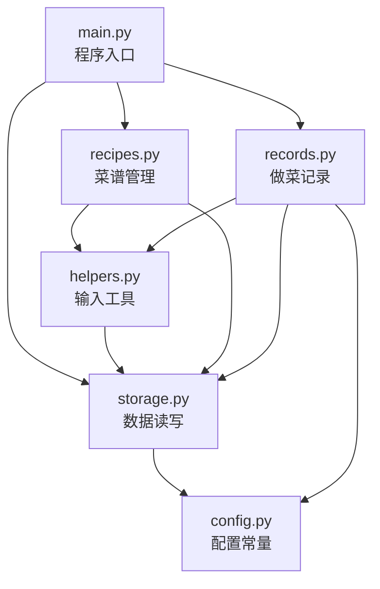
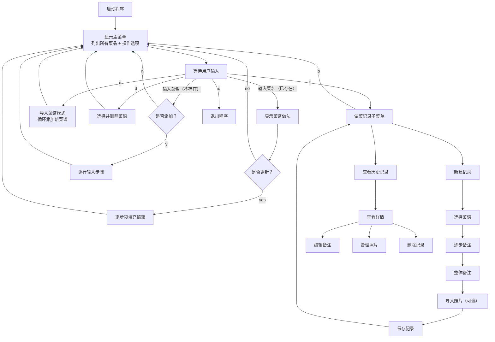

# 家庭食谱管理系统

一个基于终端交互的家庭食谱管理工具，支持菜谱的增删改查、做菜实践记录（含逐步备注）以及照片保存功能。

## 功能列表

| 功能 | 说明 |
|------|------|
| 查看菜谱 | 输入菜名即可查看完整做法 |
| 添加菜谱 | 查询不存在的菜名时自动引导添加 |
| 导入菜谱 | 批量添加新菜谱，支持连续导入 |
| 编辑菜谱 | 在原有步骤上直接修改（预填充），可增删步骤 |
| 删除菜谱 | 按菜名或序号删除，二次确认防误删 |
| 新建做菜记录 | 选择菜谱后逐步添加备注，支持整体备注和照片导入 |
| 查看历史记录 | 浏览所有做菜记录，查看详情 |
| 编辑记录备注 | 预填充原有备注，方便修改 |
| 照片管理 | 追加或删除记录关联的照片 |
| 删除记录 | 删除记录的同时自动清理照片文件 |

## 目录结构

```
.
├── main.py           # 程序入口：主菜单循环和用户交互分发
├── config.py         # 配置模块：路径常量、默认菜谱、照片格式白名单
├── storage.py        # 数据持久化：JSON 读写函数和全局数据持有
├── helpers.py        # 输入工具：预填充输入、逐行步骤输入、选菜辅助
├── recipes.py        # 菜谱管理：查看、添加、编辑、导入、删除
├── records.py        # 做菜记录：新建、查看、编辑、删除、照片管理
├── recipes.json      # [数据] 菜谱数据（自动生成）
├── records.json      # [数据] 做菜记录数据（自动生成）
├── photos/           # [数据] 照片存储目录，按记录 ID 分子目录
│   └── <record_id>/
│       ├── 1.jpg
│       └── 2.png
└── README.md         # 本文件
```

## 模块依赖关系



## 数据文件格式

### recipes.json

键为菜名，值为步骤列表：

```json
{
  "番茄炒蛋": [
    "1. 鸡蛋打散，加少许盐搅匀",
    "2. 番茄切块备用",
    "3. 热锅凉油，倒入蛋液炒至凝固后盛出"
  ],
  "南瓜馒头": [
    "1. 南瓜去皮切片，上锅蒸熟后压成泥",
    "2. ..."
  ]
}
```

### records.json

记录列表，每条记录包含以下字段：

```json
[
  {
    "id": "20260310_143052",
    "name": "番茄炒蛋",
    "date": "2026-03-10 14:30",
    "steps": [
      {
        "text": "1. 鸡蛋打散，加少许盐搅匀",
        "note": "用了 3 个鸡蛋"
      },
      {
        "text": "2. 番茄切块备用",
        "note": ""
      }
    ],
    "note": "整体偏咸，下次少放盐",
    "photos": [
      "photos/20260310_143052/1.jpg",
      "photos/20260310_143052/2.png"
    ]
  }
]
```

## 核心交互流程



## 运行方式

### 环境要求

- Python 3.10+
- macOS / Linux / Windows

### 安装依赖

macOS 用户建议安装 `gnureadline` 以获得更好的输入编辑体验（预填充功能依赖此包）：

```bash
pip3 install gnureadline
```

> 如果未安装 `gnureadline`，程序会自动回退到系统自带的 readline，但 macOS 上预填充功能可能无法正常显示。

### 启动程序

```bash
python3 main.py
```

首次运行时会自动生成 `recipes.json`（包含两个示例菜谱）。做菜记录和照片会在使用过程中自动创建。
